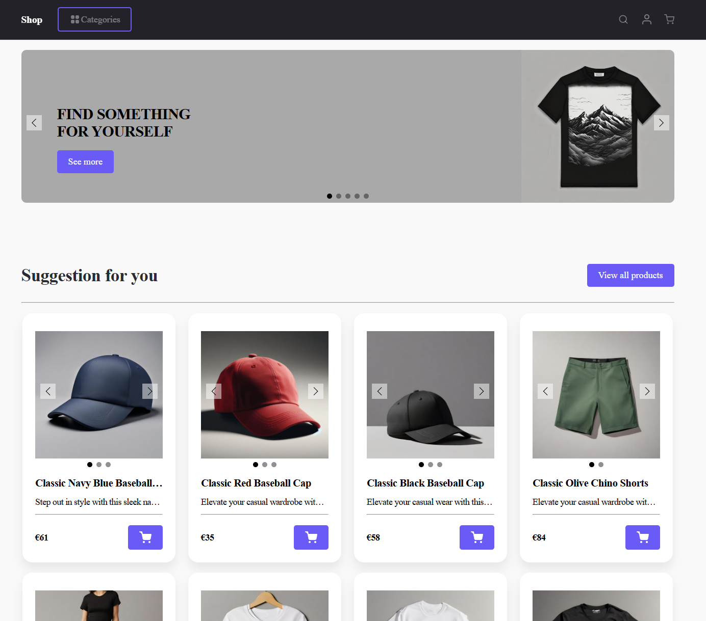
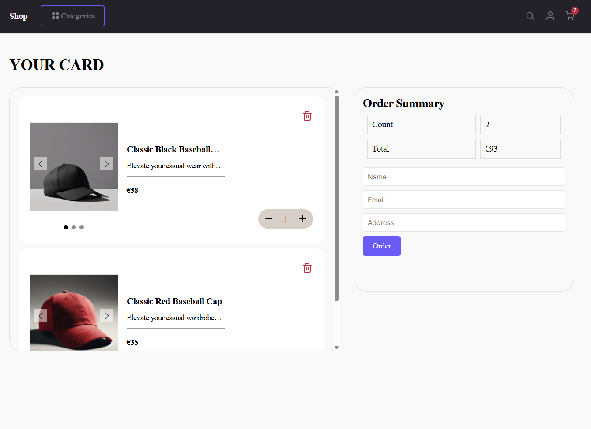
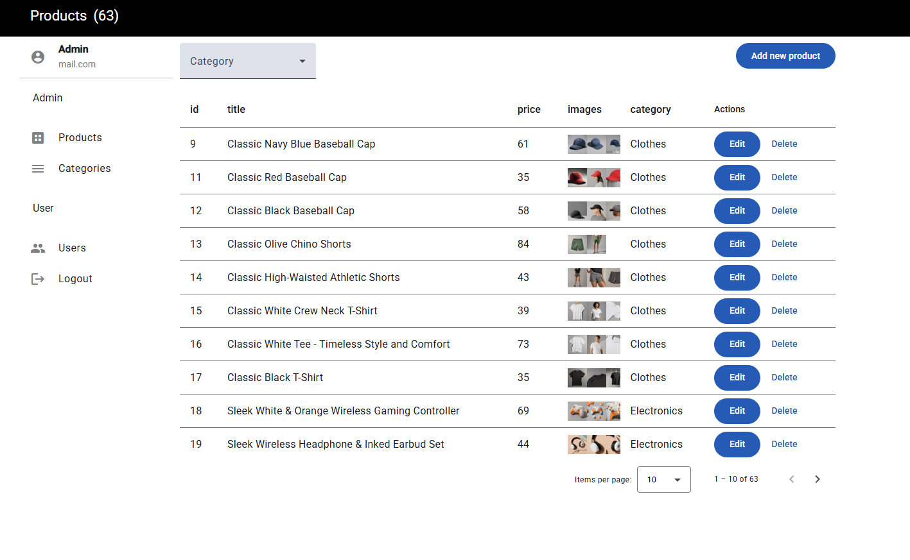

# 🛍️ E-Commerce Angular

**E-Commerce Angular** is a front-end web application for an online store, built with the latest technologies including Angular 18 (Standalone Components), RxJs. The project supports features like shopping cart, user authentication, product filtering, and an admin panel for managing products.

---

## 📸 Screenshots

### 🖥️ Homepage


### 🛒 Product Details & Cart


### 📋 Admin Panel


---

## 🚀 Technologies Used

- **Angular 18** (Standalone Components)
- **RxJS** – Reactive programming
- **SCSS** – Styling

---

## 📦 Features

- ✅ User registration and login
- ✅ Product listing with filters with price.
- ✅ Product details page
- ✅ Add/remove items to cart
- ✅ Admin panel for product management
- ✅ Responsive design

---
### 🔗 Live Demo

Check out the deployed version of this project:  
👉 [**E-Commerce Angular — Live Site**](https://e-commerce-angular-self.vercel.app)

---

## 🧑‍💻 Getting Started

### 1. Clone the repository

```bash
git clone https://github.com/Dmytro-Doronin/e-commerce-angular.git

cd e-commerce-angular

### 2. Install dependencies

npm install

### 3.  Run the development server

ng serve

Open http://localhost:4200 in your browser.
